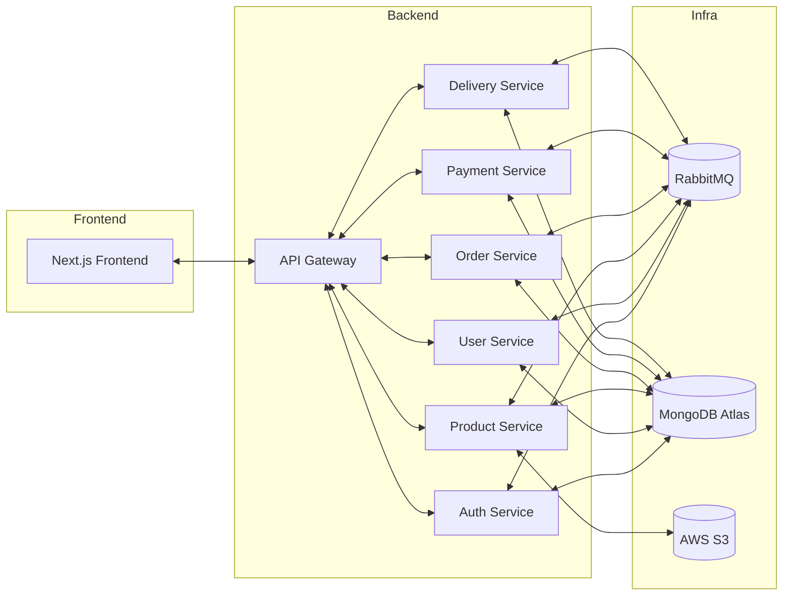

# QuickStore - Multi-Service E-Commerce Platform

## 1. Project Overview

QuickStore is a scalable, microservices-based e-commerce platform supporting user authentication, product management, order processing, payment handling, and delivery tracking. It leverages modern web technologies, containerization, and event-driven communication for robust, scalable operations in a Kubernetes environment.

---

## 2. System Architecture Diagram



---

## 3. Stack Used

- **Frontend:** Next.js (React)
- **Backend:** Node.js, Express, TypeScript
- **Database:** MongoDB Atlas
- **Message Broker:** RabbitMQ
- **Storage:** AWS S3 (for product images)
- **Payment Gateway:** Razorpay
- **Containerization:** Docker, Docker Compose
- **Orchestration:** Kubernetes
- **CI/CD:** GitHub Actions
- **SSL/TLS:** cert-manager with Let's Encrypt
- **Ingress Controller:** NGINX Ingress

---

## 4. Folder Structure

```
Root Directory/
├── api-gateway/
├── auth-service/
├── delivery-service/
├── frontend/
├── order-service/
├── payment-service/
├── products-service/
├── user-service/
├── k8s-manifests/
│   ├── api-gateway-depl.yaml
│   ├── auth-service-depl.yaml
│   ├── certificate.yaml
│   ├── delivery-service-depl.yaml
│   ├── frontend-depl.yaml
│   ├── ingress-nginx-depl.yaml
│   ├── letsencrypt-prod.yaml
│   ├── order-service-depl.yaml
│   ├── payment-service-depl.yaml
│   ├── products-service-depl.yaml
│   ├── rabbitmq-depl.yaml
│   └── user-service-depl.yaml
├── docker-compose.yml
└── README.md
```

---

## 5. Setup Instructions

### SSH (if deploying to remote server)

```sh
ssh user@your-server-ip
```

### Clone the Repository

```sh
git clone <repo-url>
cd <repo-directory>
```

### Environment Variables

Create a `.env` file in each service directory. Examples:

**API Gateway (.env)**
```
PORT=3001
AUTH_SERVICE_URL=http://auth-service-srv:4000
USER_SERVICE_URL=http://user-service-srv:4001
PRODUCT_SERVICE_URL=http://products-service-srv:4002
ORDER_SERVICE_URL=http://order-service-srv:4003
PAYMENT_SERVICE_URL=http://payment-service-srv:4004
DELIVERY_SERVICE_URL=http://delivery-service-srv:4005
FRONTEND_URL=http://frontend-srv:3000
```

**Auth Service (.env)**
```
PORT=4000
MONGODB_URI=mongodb+srv://<username>:<password>@cluster0.hchjyx3.mongodb.net/quick-store-auth-service
RABBITMQ_URL=amqp://rabbitmq-service:5672
EXCHANGE_NAME=user-registration
JWT_SECRET=your-secret-key
EMAIL_USER=your-email@example.com
EMAIL_PASS=your-email-password
```

**Frontend (.env)**
```
NEXT_PUBLIC_RAZORPAY_KEY_ID=rzp_test_Wsp2NzIUWHF2Cm
NEXT_PUBLIC_API_GATEWAY_URL=https://thestore.pw
NEXT_PUBLIC_API_URL=https://thestore.pw
```

### Docker Compose (For local development)

```sh
docker-compose up --build
```

- This will start all services and RabbitMQ.
- Access frontend at `http://localhost:3000` (or as configured).

---

## 6. Hosting & Deployment Steps

### Using Kubernetes (Production Deployment)

1. **Create ConfigMaps for environment variables:**
   ```sh
   kubectl create configmap frontend-env --from-env-file=./frontend/.env
   kubectl create configmap api-gateway-env --from-env-file=./api-gateway/.env
   kubectl create configmap auth-service-env --from-env-file=./auth-service/.env
   kubectl create configmap delivery-service-env --from-env-file=./delivery-service/.env
   kubectl create configmap order-service-env --from-env-file=./order-service/.env
   kubectl create configmap payment-service-env --from-env-file=./payment-service/.env
   kubectl create configmap products-service-env --from-env-file=./products-service/.env
   kubectl create configmap user-service-env --from-env-file=./user-service/.env
   ```

2. **Deploy RabbitMQ:**
   ```sh
   kubectl apply -f k8s-manifests/rabbitmq-depl.yaml
   ```

3. **Deploy microservices:**
   ```sh
   kubectl apply -f k8s-manifests/auth-service-depl.yaml
   kubectl apply -f k8s-manifests/user-service-depl.yaml
   kubectl apply -f k8s-manifests/products-service-depl.yaml
   kubectl apply -f k8s-manifests/order-service-depl.yaml
   kubectl apply -f k8s-manifests/payment-service-depl.yaml
   kubectl apply -f k8s-manifests/delivery-service-depl.yaml
   kubectl apply -f k8s-manifests/api-gateway-depl.yaml
   kubectl apply -f k8s-manifests/frontend-depl.yaml
   ```

4. **Set up NGINX Ingress Controller:**
   ```sh
   kubectl apply -f https://raw.githubusercontent.com/kubernetes/ingress-nginx/controller-v1.11.1/deploy/static/provider/cloud/deploy.yaml
   ```

5. **Set up SSL with cert-manager:**
   ```sh
   kubectl apply -f https://github.com/cert-manager/cert-manager/releases/download/v1.12.0/cert-manager.yaml
   kubectl apply -f k8s-manifests/letsencrypt-prod.yaml
   kubectl apply -f k8s-manifests/certificate.yaml
   ```

6. **Configure Ingress:**
   ```sh
   kubectl apply -f k8s-manifests/ingress-nginx-depl.yaml
   ```

7. **GitHub Actions Workflow**
   The repository contains GitHub workflows to automatically update and deploy Docker images when code is pushed to the main branch.

---

## 7. WebSocket Flow Explanation

1. **Event Publishing:**
   - Services emit events to RabbitMQ (e.g., `user.created`, `order.created`, `payment.success`, `order.status.updated`).

2. **Event Consumption:**
   - Each service subscribes to relevant events from RabbitMQ.
   - The API Gateway can establish WebSocket connections with clients using libraries like Socket.IO.

3. **Real-time Updates:**
   - When an event occurs (e.g., order status change), the respective service publishes the event to RabbitMQ.
   - The API Gateway receives the event and forwards it to connected clients via WebSockets.
   - The frontend displays real-time updates to users.

4. **Use Cases:**
   - Customers see live order status updates.
   - Delivery partners receive new order notifications in real-time.
   - Admin dashboard displays live order and payment information.

---

## 8. Scaling Plan

### a. Redis for Socket Scaling

- Implement Redis as a Socket.IO adapter to enable horizontal scaling of WebSocket connections across multiple API Gateway instances:
  ```js
  const { createAdapter } = require("@socket.io/redis-adapter");
  const { createClient } = require("redis");
  
  const pubClient = createClient({ url: "redis://redis-service:6379" });
  const subClient = pubClient.duplicate();
  
  await Promise.all([pubClient.connect(), subClient.connect()]);
  io.adapter(createAdapter(pubClient, subClient));
  ```
- This allows multiple API Gateway instances to share WebSocket state, ensuring clients can connect to any instance.

### b. Horizontal Scaling with Load Balancer

- Use Kubernetes to deploy multiple replicas of each service:
  ```yaml
  spec:
    replicas: 3
    selector:
      matchLabels:
        app: api-gateway
  ```
- The NGINX Ingress Controller acts as a load balancer, distributing traffic across service replicas.
- Ensure services are stateless, using MongoDB and RabbitMQ for shared state and messaging.
- Configure autoscaling based on CPU/memory usage or custom metrics:
  ```yaml
  apiVersion: autoscaling/v2
  kind: HorizontalPodAutoscaler
  metadata:
    name: api-gateway-hpa
  spec:
    scaleTargetRef:
      apiVersion: apps/v1
      kind: Deployment
      name: api-gateway
    minReplicas: 2
    maxReplicas: 10
    metrics:
    - type: Resource
      resource:
        name: cpu
        target:
          type: Utilization
          averageUtilization: 70
  ```

---

## 9. Future Improvements (Optional)

- **Monitoring and Observability:**
  - Implement Prometheus and Grafana for metrics collection and visualization
  - Add distributed tracing with Jaeger or Zipkin
  - Set up centralized logging with ELK stack (Elasticsearch, Logstash, Kibana)

- **Security Enhancements:**
  - Implement rate limiting to prevent API abuse
  - Add OAuth 2.0 / OpenID Connect for secure authentication
  - Secure secrets management with Kubernetes Secrets or HashiCorp Vault
  - Regular security audits and penetration testing

- **Performance Optimization:**
  - Implement caching strategies using Redis
  - Add CDN integration for static assets
  - Optimize database queries and implement indexing strategies

- **Feature Additions:**
  - Support for multiple payment gateways
  - Advanced analytics dashboard
  - Mobile app clients (iOS/Android)
  - Multi-language support
  - Recommendation engine based on user behavior

- **DevOps Improvements:**
  - Enhanced CI/CD pipelines with automated testing
  - Blue/Green deployment strategy
  - Disaster recovery plan
  - Infrastructure as Code (IaC) using Terraform
  - Chaos engineering tests to verify system resilience
